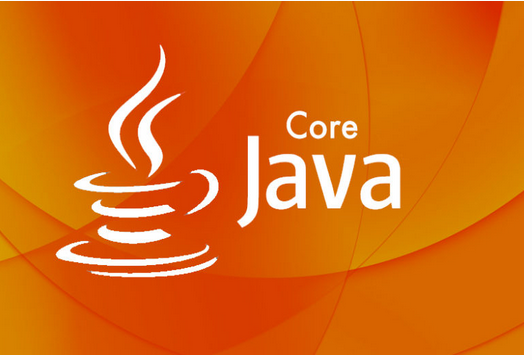
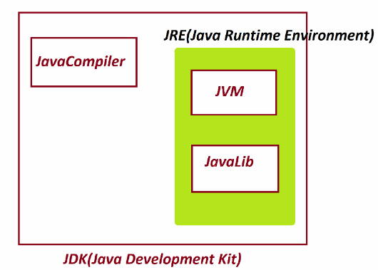
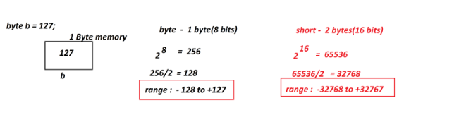
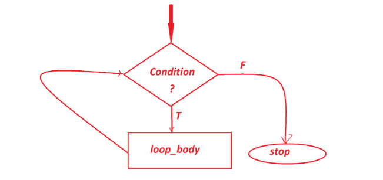
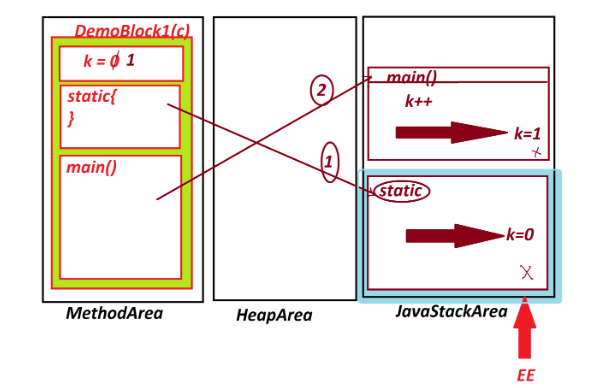
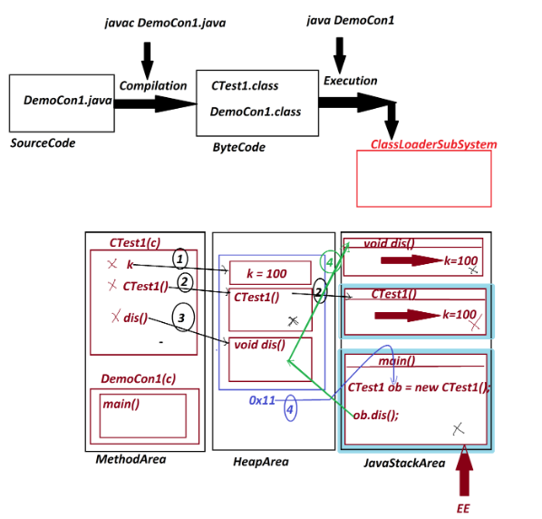
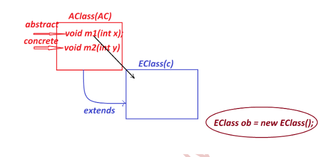
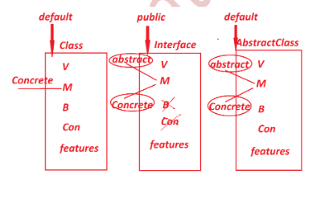

# CORE JAVA

## TABLE OF CONTENT

### 1.Java Alphabets (Java Programming Components)

### 2.Java Programming Concepts

### 3.Object Oriented Programming features

### Creating Java Project using IDE Eclipse:

### (i) JDK

### (ii) JRE

### (iiiv) JVM

### 2.Java Alphabets(Java Programming Components)

### (a) Java Data Types

### (b) While Loop,Do While loop,For Loop

### (c) variables
    
### (d) Blocks

### (e) Constructors

### (f) Interfaces

### (g) AbstractClasses

### 3.Object Oriented Programming features

### (a) Encapsulation

### (b) Abstraction

### (c)Inheritance

### (d) PolyMorphism

### 4.References

...........................................................................

### Creating Java Project using IDE Eclipse:

Creating Java Project using IDE Eclipse:
step-1 : Open IDE Eclipse,while opening name the WorkSpace and
Click "Launch"

step-2 : Create Java Project

Click on File->;new->;Project->Java->select "Java Project" and click

"Next"->name the Project and click "Finish"

step-3 : Create packages in "src"

RightClick on "src"->new->package,name the package and click
"Finish"

step-4 : Create classes under packages

RightClick on package->new->Class,name the class and click "finish"

### (i)JDK:

JDK stands for "Java Development Kit" and which provide the

following:-

(a) JavaCompiler

(b) JVM

(c) JavaLib

(a)JavaCompiler:-

Java Compiler will perform Compilation process,which means
checks gramitical(syntax) rules and convert SourceCode into
ByteCode.

(b)JVM:-

JVM stands for "Java Virtual Machine" and which is used to
execute byte code and generate result.

(c)JavaLib:-

JavaLib will provide pre-defined and ready constructed
components,which are used in application development.

...........................................................................

(i)JRE:-

JRE stands for "Java Runtime Environment" and which is
execution environment.

JRE means combination of JVM and JavaLib

(iiiv)JVM:-

JVM is an internal part of JRE

===========================================================================

### *Imp

Instaling Java S/w and setting path:

step-1 : Download JDK from Oracle WebSite

Link => https://www.oracle.com/in/java/technologies/downloads/

step-2 : Install JDK

### Note:

After installation process is successfull,then we can find
one folder with name "java" in Programfiles.
C:\Program Files\Java

step-3 : set Javapath in "Environment Variables"

RightClick on MyComputer->Properties->Advanced System Settings->
Environment Variables,click "new"from "System Variables"

### Variable name : path

Variable Value : C:\Program Files\Java\jdk-17.0.4.1\bin;

step-4 : Click "ok" for three times

===========================================================================

### Note:

Open CommandPromt and check the following commands are working
or not:

javac - Compilation Command

java - Execution Command

===========================================================================

### Datatypes in Java

The types of data which we are expecting as input to JavaPrograms are
known as DataTypes in Java.

DataTypes in Java are categorized into two types:-

1.Primitive datatypes

2.NonPrimitive datatypes

#### 1.Primitive datatypes:

The "single valued data formats"are known as Primitive datatypes.

Primitive datatypes are categorized into four types:-

(a)Integer datatypes

(b)Float datatypes

(c)Character datatype

(d)Boolean datatype

### (a)Integer datatypes:

The numeric data which is represented without decimal point are
known as Integer datatypes.

Integer datatypes are categorized into four types:

(i)byte - 1 byte(8 bits)

(ii)short - 2 bytes

(iii)int - 4 bytes

(iv)long - 8 bytes

"byte"and "short" are used for Multi-media data or Stream data.
"int"is used in normal application development
"long"is used to hold large integer values like PhNo,CardNO,...
Coding rule : In the process of assigning long-value we must use
zL or "l"in the RHS of declaration

Ex:
long ph = 9898981234L;

### (b)Float datatypes :

The numeric data which is represented with decimal point are known
as Float datatypes.

Float datatypes are categorized into 2 types:

(i)float - 4 bytes

(ii)double - 8 bytes

"float"is used in normal applications,but while assigning float-value
we must use "F" or "f" in the RHS of decsyntax:
for(Initialization;Condition;Incre/Decre)
{
//Loop_body
}laration.

=================================================================================

### Ex : DataTypes.java

class DataTypes
{
public static void main(String args[])
{
byte b = 127;
short s = 23456;

int i = 567823;

long ph = 9898981234L;

float f = 12.34F;

double d = 1234.56;

System.out.println("byte value="+b);

System.out.println("short value="+s);

System.out.println("int value="+i);

System.out.println("long value="+ph);

System.out.println("float value="+f);

System.out.println("double value="+d);

}

}

o/p:

byte value=127

short value=23456

int value=567823

long value=9898981234

float value=12.34

double value=1234.56

### Iterative Statements:

The following are some important iterative statements:

(a)while loop

(b)do-while loop

(c)for loop

### (a)while loop:

In while looping structure the condition is checked first and if the
condition is true then the loop_body is executed,this process is repeated
until the condition is false.

syntax:
while(condition)

{

//loop_body(statements)

}

### (b)do-while loop:

In do-while looping structure the loop-body is executed first
and then the condition is checked,if the condition is true then it
is repeated.

This process is repeated until the condition is false.

syntax:

do

{

//Loop_body

}

while(condition);

### (c)for loop:

"for" loop is more simple in representation when compared to
while and do-while loops,because Initialization,Condition and

Incre/Decre declared in the same line.

syntax:

for(Initialization;Condition;Incre/Decre)

{

//Loop_body

}

### Java Variables:

Variables are the data holders used in the programs.

Based on datatypes,the variables are categorized into two types:

Variables are the data holders used in the programs.

Based on datatypes,the variables are categorized into two types:

### 1.Primitive datatype variables:

The variables which are declared with primitive datatypes like
byte,short,int,long,float,double,char and boolean are known as primitive
datatype variables.

These Primitive datatype variables will hold values.

### 2.NonPrimitive datatype variables:

The variables which are declard with NonPrimitive datatypes like
Class,Interface,Array and Enum are known as NonPrimitive datatype
variables or referential datatype variables.

These NonPrimitive datatype variables will hold Object references or
Object Addresses.

### define "static"

"static" keyword in Java will decide the memory location of
Programming components.

static - means memory in class

NonStatic - means memory in Object

based on "static" keyword the variables in Java are categorized into

two types:

(1)Static variables

(2)NonStatic variables

### (1)Static variables:

The variables which are declared with "static"keyword are known as
static variables or Class variables.

These static variables will get the memory within the class while
class loading and can be accessed with class_name.

### (2)NonStatic variables:

The variables which are declared without static keyword are known
as NonStatic variables.

These NonStatic variables are categorized into two types:

(i)Instance Variables

(ii)Local Variables

### (i)Instance Variables

The nonStatic variables which are declared outside the methods are
known as Instance Variables or Object Variables.

These Instance variables will get the memory within the Object while
Object creation process and can be accessed with Object_name.

### (ii)Local Variables:

The NonStatic variables which are declared inside the methods are
known as Local Variables or Method Variables.

These Local variables can be accessed directly within the method.
These Local variables will get the memory within the methods while.

method execution.
Ex : Demovariables.java

class DemoVariables

{

static int a=10;

int b=20;

public static void main(String args[])

{

int c = 30;

System.out.println("a value="+DemoVariables.a);

DemoVariables ob = new DemoVariables();

System.out.println("b value="+ob.b);

System.out.println("c value="+c);

}
}

o/p:

a value=10

b value=20

c value=30

======================================================================

### Blocks in Java:

The set-of-statements which are declared within the flower
brackets and executed automatically is known as block.

Blocks in Java are categorized into two types:

1.static blocks

2.NonStatic blocks(Instance blocks)

### 1.static blocks:

The blocks which are declared with "static"keyword are known
as static blocks or Class blocks.

syntax:

static
{
//statements
}

Ex-program-1 :

Program demonstrating static block in MainClass?

Program : DemoBlock1.java

class DemoBlock1

{

static int k;

static

{

System.out.println("***static block***");

System.out.println("The value k:"+k);

}

public static void main(String[] args)

{

k++;

System.out.println("***main()****");

System.out.println("The value k:"+k);

}

}

o/p:

***static block***

The value k:0

***main()****

The value k:1

Execution flow of above program:

ClassFiles:

DemoBlock1.class

Note:

static block in MainClass will be executed before main() method
execution,because static block will have highest priority in
execution.

### 2.NonStatic blocks(Instance blocks):

The blocks which are declared without "static" keyword are
known as NonStatic blocks or Instance blocks.

syntax:

{
//statements
}

Execution behaviour of Instance blocks:

Instance blocks are executed while Object creation process.

Instance blocks can access both static and Instance variables.

Ex-program : DemoBlock3.java

class BTest2

{

int x=10;

static int y=20;

{

x++;

y++;

System.out.println("****Instance block****");

System.out.println("The value x:"+x);

System.out.println("The value y:+y);

}

}

class DemoBlock3

{

public static void main(String[] args)

{

BTest2 ob1 = new BTest2();

BTest2 ob2 = new BTest2();

}

}

o/p:

****Instance block****

The value x:11

The value y:21

****Instance block****

The value x:11

The value y:22

========================================================================================================

### Constructors in Java:

Constructor is a Special method having the same name of the
class and executed while object creation process,because the
Constructor call is available in Object creation syntax attached
with "new" keyword.

while declaring constructors we must not use return_type
because the Constructor will have Class_return_type.

structure of Constructor:

Class_name(para_list)
{
//method_body
}

Based on parameters the Constructors are categorized into two
types:

1.Constructors without parameters

2.Constructors with parameters

### 1.Constructors without parameters:

The Constructors which are declared without parameters are
known as 0-parameter constructors or Constructors without parameters.

Ex-program:

DemoCon1.java(MainClass)

class CTest1

{

int k=100;

CTest1()

{

System.out.println("====CTest1()====");

System.out.println(&quot;The value k:&quot;+k);

}

void dis()

{

System.out.println("====dis()====");

System.out.println("The value k:"+k);

}

}

class DemoCon1

{

public static void main(String[] args)

{

CTest1 ob = new CTest1();//Con_call

ob.dis();//Method_call

}

}

o/p:

====CTest1()====

The value k:100

====dis()====

The value k:100

### 2.Constructors with parameters:

The Constructors which are declared with parameters are known
as Parameterized Constructors or Constructors with parameters.

Ex:

DemoCon2.java(MainClass)

import java.util.Scanner;

class CTest2

{

CTest2(int x)

{

System.out.println("====CTest2(x)====");

System.out.println("The value x:"+x);

}

void dis(int y)

{

System.out.println("=====dis(y)=====");

System.out.println("The value y:"+y);

}

}

class DemoCon2

{

public static void main(String[] args)

{

Scanner s = new Scanner(System.in);

System.out.println("Enter the value of x:");

int x = s.nextInt();

System.out.println("Enter the value of y:");

int y = s.nextInt();

CTest2 ob = new CTest2(x);//Con_call

ob.dis(y);//method_call

}

}

o/p:

Enter the value of x:

12

Enter the value of y:

21

====CTest2(x)====

The value x:12

=====dis(y)=====

The value y:21

Execution flow of DemoCon1.java(0-parameter Constructor)

================================================================================================

### Interface in Java:

Interface is a collection of variables,abstract methods and
Concrete methods from Java8 version onwards.

(Upto Java7 version Interface is collection of Variables and
abstract methods,but cannot hold Concrete methods)

#### define abstract methods?

The methods which are declared without method_body are known as
abstract methods.

structure of abstract methods:

return_type method_name(para_list);

### return_type method_name(para_list);

The methods which are declared with method_body are known as
Concrete methods.

structure of concrete methods:

return_type method_name(para_list)

{
//method_body
}

### Coding rules of Interface:

Coding rules of Interface:

Rule-1 : we use "interface" keyword to declare interfaces.

syntax:

interface Interface_name
{
//Interface_body
}

Rule-2 : The programming components which are declared in interface
are automatically"public"

Note:

The programming components which are declared in classes
without any access modifiers are considered as "default"
automatically.

Rule-3 : Interfaces can be declared with both Primitive datatype
variables and NonPrimitive datatype variables.

Rule-4 : The variables which are declared in Interfaces are
automatically static and final variables.

Note:

(i)static variables in interfaces will get the memory
within the interface while interface loading and can be
accessed with Interface_name

(ii)final variables must be intialized with values and
once initialized cannot be modified.
(final variables are also known as Constant variables
or Secured Variales)

(iii)we cannot declared NonStatic variables in interfaces
because the variables declared in interfaces are
automatically Static.

Rule-5 : The methods which are declared in interfaces are
automatically NonStatic abstract methods.

Note:

There no concept of static abstract methods.

Rule-6 : Interfaces in Java cannot be instantiated,which means we
cannot create object for interfaces.

Rule-7 : Interfaces are implemented to classes using &quot;implements&quot;
keyword and the classes are known as implementation
classes.

Rule-8 : These implementation classes must construct body for all
abstract methods of Interfaces.

Example:

ITest.java

package p1;

public interface ITest {

public static final int k=300;

public abstract void dis();

}

IClass.java

package p1;

public class IClass implements ITest{

public void dis() {

System.out.println(&quot;****dis()****&quot;);

System.out.println(&quot;The value k:&quot;+k);

}

}

DemoInterface.java(MainClass)

package p2;

import p1.ITest;

import p1.IClass;

public class DemoInterface1 {

public static void main(String[] args) {

System.out.println("****main()****");

System.out.println("The value k:+ITest.k);

//ITest ob = new ITest();//Error

IClass ob = new IClass();

ob.dis();

}

}

o/p:

****main()****

The value k:300

****dis()****

The value k:300

=======================================================================================

### Abstract Classes in Java:

The classes which are declared with "abstract" keyword are
known as abstract classes.

Abstract Classes are collection of Variables,abstract methods,
Concrete methods,Blocks,Constructors and features.

Abstract classes cannot be instantiated,which means we cannot
create objects for Abstract Classes.

These abstract classes must be extended to classes using
"extends" and the classes are known as extention-classes or
Implementation classes.

These extention-classes must construct body for abstract methods
of AbstractClasses.

Diagram:

Ex:

AClass.java

package p1;

public abstract class AClass {

public abstract void m1(int x);

public void m2(int y) {

System.out.println(&quot;****m2(y)****&quot;);

System.out.println(&quot;The value y:&quot;+y);

}

}

EClass.java

package p1;

public class EClass extends AClass{

public void m1(int x) {

System.out.println("***m1(x)***");

System.out.println("The value x:"+x);

}

}

DemoAbstractClass.java(MainClass)

package p2;

import p1.*;

public class DemoAbstractClass {

public static void main(String[] args) {

EClass ob = new EClass();

ob.m1(11);

ob.m2(12);

}

}

o/p:

***m1(x)****

The value x:11

****m2(y)****

The value y:12

Comparision Diagram:

### What is the diff b/w

(i)Class
(ii)Abstract Class

Class will hold only Concrete methods,but Abstract Classes will
hold both abstract methods and Concrete methods.
Class can be Instantiated,but Abstract classes cannot be
Instantiated.

### What is the diff b/w

(i)Interface
(ii)Abstract Class

Variables in Interfaces are automatically "static and final"
but variables in Abstract Classes are User Choice.

Interfaces cannot hold "Blocks and Constructors",but Abstract
Classes can hold "Blocks and Constructors".

abstract keyword is not manditory to declare abstract methods
in Interfaces,but "abstract" keyword is manditory to declare
abstract methods in Abstract Classes.

=============================================================================

### 1. Encapsulation

Encapsulation is the technique of bundling the data (variables) and the code (methods) that operates on the data into a single unit called an object. It restricts direct access to some of the object's components, which can prevent the accidental modification of data.

Benefits of Encapsulation:

Protects the internal state of an object from unwanted changes.

Enhances code maintainability and flexibility.

Facilitates modularity by hiding the implementation details.

### 2. Abstraction

Abstraction is the concept of hiding the complex implementation details and showing only the essential features of an object. It allows focusing on what the object does instead of how it does it. Abstraction can be achieved using abstract classes and interfaces.

Benefits of Abstraction:

Reduces complexity by hiding unnecessary details.
Enhances code readability and maintainability.
Helps in achieving a clear separation of concerns.

### 3. Inheritance

Inheritance is a mechanism where a new class, called a subclass, is derived from an existing class, called a superclass. The subclass inherits attributes and methods from the superclass, which promotes code reusability and establishes a natural hierarchy between classes.

Benefits of Inheritance:

Promotes code reusability.
Establishes a relationship between classes.
Facilitates method overriding and polymorphism.

### 4. Polymorphism

Polymorphism means "many shapes" and allows one interface to be used for a general class of actions. The specific action is determined by the exact nature of the situation. Polymorphism can be achieved through method overloading (compile-time polymorphism) and method overriding (runtime polymorphism).

Benefits of Polymorphism:

Enhances flexibility and maintainability of the code.
Allows the use of a single interface for different underlying forms (data types).
Simplifies code by eliminating the need for multiple conditional statements.

### 4.References

https://www.javatpoint.com/java-tutorial

https://www.w3schools.com/java/

